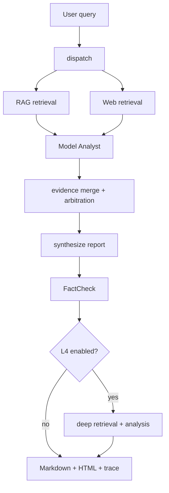

# Conflux

Conflux 是一个本地优先的研究工作台，将论文发现、知识入库、多源证据调研和项目进度审计连接起来，并生成可追溯的 Markdown、HTML 和结构化运行产物。

当前项目适合个人研究和工程能力展示，重点包括多源检索编排、Evidence Graph、FactCheck、Chunk 级引用、离线评测和结构化 Trace。可扩展 ResearchOps 架构改造已完成 M0-M2；**V2 `answer_first` 为唯一管道（P1/P1.5 已清理）**，已通过**三批真实 API 盲评退出判定**（均分 3.2/5，deepseek-v4-flash-guan）；I/J/K（参数调优 / 硬编码退出主路径 / 废弃代码清理）已完成；**R1 检索消融实验**完成（`text-embedding-v4` 胜出、rerank 负面结论）；P2 paper radar 核心已实现，M3 持久化待启动。详见 [项目总体进展报告](docs/plans/done/项目总体进展报告.md)。

## 当前技术能力

- LangGraph 工作流：唯一管道 V2 `answer_first`（线性 6 步 decompose→retrieve→generate→synthesize→audit→finalize）；P1/P1.5 旧管道已于 2026-08 清理（stage K）。
- 来源状态协议包含 `success`、`low_relevance`、`no_evidence`、`failed` 和 `fallback`。
- `no_evidence`、`failed` 和 `fallback` 来源不会进入 Evidence Graph 共识投票。
- 来源结果包含声明级 `evidence_refs`、`confidence` 和 `limitations`。
- RAG 结果使用 `[RAG:quantum-crypto.txt#chunk-p0-c0]` 等 Chunk 级引用。
- FactCheck 包含确定性追溯检查、独立模型核查、主答案修订和轻量复核闭环。
- Deep 档支持六维研究计划、RunScoped 临时全文、数字引用编译、置信度附录和匿名成对盲评。
- V2 `answer_first` 是唯一管道，走 decompose→retrieve→generate→synthesize→audit→finalize 流程；`research.pipeline` 中其他取值会归一化为 `answer_first` 并提示。
- Trace JSONL 和 Run Summary JSON 用于检查每次运行的阶段和来源状态。
- 离线评测覆盖检索质量、报告验收、来源故障矩阵、预算硬上限、失败来源泄漏、Prompt Injection 和章节追溯；真实 API 三批盲评已于 2026-08-01 执行（连续三批退出判定达成）。

## 为什么使用 LangGraph

当前调研流程需要明确状态边界、并行检索分支、条件路由和可选 Checkpointer。仓库已接入内存 Checkpointer，并记录 `run_id`、`thread_id`、Checkpoint 后端、来源状态和阶段进度；内存后端不会在进程重启后保留状态，因此当前不能宣称已经支持持久断点恢复。

下图展示历史 p1/p15 并行 agent 流程（已删除）；当前唯一 V2 pipeline 为线性 6 步：



## 当前可用于简历展示的能力

- 构建可复现的多源研究系统，包含样例报告、验收检查和来源感知的报告生成。
- 使用 LangGraph 实现并行检索、分阶段分析、内存 Checkpoint 接口和结构化 Trace。
- 构建包含混合检索、Chunk 级引用和离线检索评测的 RAG 流程。
- 设计声明级证据协议、置信度、冲突仲裁和失败来源排除规则。
- 建立覆盖来源失败、证据分歧、幻觉泄漏、Prompt Injection 和报告验收的评测 Harness。

## 仓库结构

```text
.
├── config.yaml
├── .env.example
├── examples/
├── docs/
│   ├── README.md
│   ├── 架构设计.md
│   ├── plans/
│   │   ├── 执行计划v1.md        # 执行主线；V2 已完成，P2/M3 待启动
│   │   ├── R1检索消融实验方案.md  # R1 实验方案（4 embedding × 3 chunk + rerank）
│   │   └── done/
│   │       ├── 项目总体进展报告.md # 全部阶段状态总览
│   │       ├── V2实现总结.md
│   │       └── 阶段R完成摘要.md
│   ├── benchmarks/
│   │   └── V2退出报告h3.md      # V2 盲评退出判定
│   └── retrospectives/
│       └── P1执行回顾.md
├── data/
│   ├── documents/              # 本地语料（65 md + 190 论文摘要 + 34 PDF）
│   └── rag_eval/               # R1 三语评测集（zh_zh/zh_en/en_en 各 10 题）
├── prompts/
├── scripts/
│   ├── eval_rag_ablation.py    # R1 检索消融（S1/S2/跨语言，ranx）
│   ├── eval_web_search.py      # R2 Web 搜索质量评测
│   ├── eval_ablation.py        # R3 P1 消融
│   ├── eval_gates.py           # R4 端到端门禁统计
│   ├── run_v2_blind_batch.py   # V2 批量盲评（连续三批退出）
│   └── eval_retrieval.py / eval_reports.py / eval_end_to_end.py
├── src/conflux/
│   ├── __main__.py
│   ├── graph_v2.py             # V2 answer_first 管道
│   ├── graph_p15.py 等已删除     # P1/P1.5 旧管道（stage K）
│   ├── checkpointing.py / trace.py / source_status.py / evidence.py / report.py
│   ├── tools/ / rag/ / paper_radar/ / workbench/
└── tests/                      # 287 个测试（pytest）
```

## 文档与后续方向

- [PRODUCT.md](PRODUCT.md)：当前产品定位和设计原则。
- [DESIGN.md](DESIGN.md)：当前工作台视觉和交互约束。
- [docs/README.md](docs/README.md)：项目文档索引与分类说明。
- [docs/架构设计.md](docs/架构设计.md)：已批准的可扩展 ResearchOps 长期架构蓝图。
- [docs/plans/done/项目总体进展报告.md](docs/plans/done/项目总体进展报告.md)：**全部阶段（A/R/B/C、V2 H-K、P2/M3）状态总览**。
- [docs/plans/执行计划v1.md](docs/plans/执行计划v1.md)：M0-M2、P0、P1 已完成验收，V2 H-K 已闭合，P2/M3+ 尚未启动的实施方案和验收记录。
- [docs/benchmarks/V2退出报告h3.md](docs/benchmarks/V2退出报告h3.md)：V2 与 P1.5 基线匿名配对盲评及退出判定。
- [reports/eval/rag_ablation/R1_summary.md](reports/eval/rag_ablation/R1_summary.md)：R1 检索消融综合报告（embedding 选择 / rerank 结论 / 生产配置建议）。
- [docs/retrospectives/P1执行回顾.md](docs/retrospectives/P1执行回顾.md)：P1 从失败基线到最终 Deep/full 验收的执行与技术复盘。

蓝图负责把握项目方向，执行方案负责实现方法和验收标准。M1/M2 已完成核心协议、第一方能力、动态来源和 YAML 工作流，P1 已完成研究质量闭环；**V2 `answer_first` 已通过三批真实 API 盲评退出，I/J/K 与 R1 检索消融已完成**；持久 Run Store、Evidence Ledger 等 M3 内容尚未开始实施。

## 安装

```powershell
python -m pip install -e ".[dev]"
```

将 `.env.example` 复制为仅供本地使用的 `.env`，不要提交真实密钥。

模型由用户在 `config.yaml` 中配置。低/中/高档只定义角色、检索预算、并发、核验强度和超时，不在后台绑定具体提供商或型号。以下是结构示例：

```yaml
models:
  fast:
    provider: openai_compatible
    model: your-fast-model
    base_url: https://your-gateway.example/v1
  strong:
    provider: openai_compatible
    model: your-strong-model
    base_url: https://your-gateway.example/v1

research:
  pipeline: answer_first  # answer_first 是唯一管道；其他取值会归一化并提示
  profiles:
    quick:
      planner_model: fast
      synthesizer_model: fast
      max_parallel_subquestions: 2
    deep:
      planner_model: strong
      synthesizer_model: strong
      max_parallel_subquestions: 3

embedding:
  model: text-embedding-v4  # R1 消融结论：text-embedding-v4 全面胜出（zh-zh 满分 + zh-en 跨语言最强）
  base_url: https://your-gateway.example/v1
```

仓库中的具体模型名仅是当前开发测试配置，用户可以替换全部 preset 映射。Gemini 当前因成本原因暂停使用，代码不会隐式启用它。

真实运行需要配置：

```powershell
$env:OPENAI_API_KEY="your-api-key"
```

可选覆盖项：

```powershell
$env:CONFLUX_MODELS__REASONING__API_KEY="your-api-key"
$env:CONFLUX_MODELS__CHEAP__API_KEY="your-api-key"
$env:CONFLUX_MODELS__FLASH__API_KEY="your-api-key"
$env:CONFLUX_MODELS__BALANCED__API_KEY="your-api-key"
$env:CONFLUX_MODELS__VERIFIER__API_KEY="your-api-key"
$env:CONFLUX_EMBEDDING__API_KEY="your-api-key"
$env:SERPAPI_API_KEY="your-serpapi-key"
```

缺少密钥时，CLI 会在发起真实 API 请求前退出并明确说明缺失的凭证。

## 快速开始

构建本地 RAG 索引：

```powershell
python -m conflux --index data/documents
```

运行 Phase 2 调研查询：

```powershell
python -m conflux "Explain how Conflux should arbitrate RAG, Web, and Model evidence." --mode phase2 --output-dir reports --stream-events
```

运行本地研究工作台：

```powershell
python -m conflux.workbench --host 127.0.0.1 --port 8765
```

## 插件与 YAML 工作流

查看内置能力、加载用户插件目录并校验工作流：

```powershell
python -m conflux plugin list --verbose
python -m conflux plugin list --plugin-dir path\to\plugins
python -m conflux workflow validate tests\fixtures\architecture\workflows\research_query_v2.yaml --dry-run
python -m conflux workflow run tests\fixtures\architecture\workflows\test_query.yaml --input-json '{"query":"quantum crypto"}'
python -m conflux.paper_ingestion inbox --profile profiles\example_gis_agent.yaml --fixture tests\fixtures\papers\arxiv_sample.json --llm-review
```

也可以使用 `CONFLUX_PLUGIN_DIRS` 指定多个插件目录。M1/M2 插件是可信的进程内 Python 代码，Manifest 权限用于校验和审计，不提供沙箱；YAML 只组合已注册能力，不执行任意 Python。

## 项目进度审计

研究画像中的 `project_paths` 用于登记本地项目。首次运行建立基线：

```powershell
python -m conflux.progress snapshot --profile profiles/example_gis_agent.yaml --out-dir reports/progress
```

后续运行会比较 Git 提交、未提交文件、测试状态、研究产物和报告变化，并生成带证据引用的 Markdown/JSON 审计报告：

```powershell
python -m conflux.progress audit --profile profiles/example_gis_agent.yaml --since last --test-command "python -m pytest -q" --out-dir reports/progress
```

也可以在本地工作台的“进度审计”页面选择画像和项目路径后运行。审计只读取本地证据，不会上传项目文件，也不会执行未明确配置的命令。

## 多项目进度监控

工作台的“项目监控”页面统一展示本地/远程版本、未提交变更、计划基线、文档、实验产物、报告和最近审计结果。首期只支持手动刷新，Git 监控严格只读：不会执行 `pull`、`push`、`checkout` 或 `fetch`。远程检查通过 `git ls-remote` 读取版本；如果远程对象尚未进入本地对象库，界面会明确提示无法计算精确 ahead/behind。

每个项目在 `projects/` 下使用一份 YAML 作为权威配置。项目路径可以是 Git 仓库，也可以是只有文档、数据或实验产物的普通目录。非 Git 目录会显示“Git 不适用”，不会被记为故障。

```yaml
version: 1
id: kg-llm
name: KG + LLM 研究
path: E:\research\kg-llm
documents:
  directories: [docs, notes]
artifacts:
  result_dirs: [experiments, results]
  report_dirs: [reports]
plan:
  overall_goal: 验证知识图谱增强大模型推理的有效性。
  milestones:
  - id: baseline
    title: 完成基线与消融实验
    status: in_progress
  next_actions:
  - 整理实验数据并补充误差分析。
refresh:
  mode: manual
  schedule_enabled: false
  interval_minutes: null
  timezone: Asia/Shanghai
```

“分析项目计划”会读取已配置的 Markdown 文档，通过模型生成结构化计划预览，并结合代码、Git、测试、报告和研究产物进行证据核验。分析结果只有在用户明确选择并确认后才会写入项目 YAML。`schedule_enabled`、`interval_minutes` 和 `next_refresh_at` 已预留给后续定时任务，当前不会启动后台调度。

使用内存 Checkpointer 运行：

```powershell
python -m conflux "Evaluate Loop Engineering in agent workflows." --thread-id demo-loop-001 --checkpoint-backend memory --output-dir reports
```

该后端只在当前进程生命周期内保存状态。跨进程持久恢复属于已批准但尚未实施的方向，不是当前能力。

验证生成的报告：

```powershell
python -m conflux.acceptance path\to\report.md path\to\report.html
```

## 质量门禁

运行单元测试：

```powershell
python -m pytest -q
```

运行离线检索评测：

```powershell
python scripts/eval_retrieval.py --offline
```

运行离线报告评测：

```powershell
python scripts/eval_reports.py --offline
```

运行 R1 检索消融（需 API key；`--stage s1` 为底座选择，`--stage s2` 为 rerank 消融）：

```powershell
python scripts/eval_rag_ablation.py --stage s1
```

运行 Web 搜索质量评测（R2）：

```powershell
python scripts/eval_web_search.py --depth standard --k 18
```

运行 V2 批量盲评（连续三批退出判定）：

```powershell
python scripts/run_v2_blind_batch.py
```

运行 P1 消融（R3）：

```powershell
python scripts/eval_ablation.py
```

显式选择运行真实 API 冒烟测试：

```powershell
python scripts/eval_end_to_end.py --real
```

## 评测与实验结论（2026-08）

### V2 三批盲评（deepseek-v4-flash-guan，标准深度）

连续三批真实 API 运行全部 PASS（均分 3.2/5）：`policy-ai-governance` 3.3、`gis-architecture-design` 3.3、`materials-method-comparison` 3.0；三份报告均 `conf=high`。结果：`reports/evaluation/v2_batch_deepseek/batch_result.json`。盲评后完成 I/J/K（参数调优 / BILINGUAL_TERM_MAP 退出主路径 / P1+P1.5 全套删除）。

### R1 RAG 检索消融（ranx，三语数据集各 10 题）

- **底座选择（zh-zh）**：`text-embedding-v4` 与 `qwen3-embedding-8b` 全档 NDCG@10=1.000；`bge-m3` 0.819–0.963；`jina-embeddings-v4` 0.889–0.963。
- **跨语言（zh-en）**：`text-embedding-v4` **0.819** > `jina-embeddings-v4` 0.815 > `qwen3-embedding-8b` 0.806 > `bge-m3` 0.682——**8B 大模型未兑现跨语言优势**。
- **rerank（3 数据集 × 4 方法）**：12 组合中 **10 降、1 平、1 微升**（en-en jina-reranker-m0 +0.013）→ **rerank 不推荐默认**。
- **生产配置建议**：`text-embedding-v4` + chunk `512/128` + hybrid top_k=60，不启用 rerank。

完整结论与逐配置指标：`reports/eval/rag_ablation/R1_summary.md`。

## 当前离线基线

确定性离线检索评测输出：

- `reports/eval/retrieval_eval.md`
- `reports/eval/retrieval_eval.json`

报告评测输出：

- `reports/eval/report_eval.md`
- `reports/eval/report_eval.json`

这些产物包含 recall@k、hit rate、来源覆盖、无关结果比例、验收通过率、失败来源泄漏、Prompt Injection 泄漏、延迟和成本估算。

全量测试基线：**287 passed**（`python -m pytest -q`）；R1 三语评测集关键词自检 100% 命中（`data/rag_eval/`）。真实 API 盲评与 R1 消融已于 2026-08-01 执行，无需再批准预算。

## 示例

- [三个来源均成功](examples/three_sources_success.md)
- [Web 失败，RAG 和 Model 成功](examples/web_failed_rag_model_success.md)
- [RAG 与 Web 存在冲突](examples/rag_web_conflict.md)

## 安全

- API Key 只通过环境变量或本地 Secret 配置提供。
- `.env`、生成报告、Chroma 数据库、缓存和运行产物均被 Git 忽略。
- RAG 检索到的 Prompt Injection 文本只作为证据内容，不能成为系统指令。
- `failed` 和 `fallback` 来源对用户可见，但不能成为 Evidence Graph 节点。

## 许可证

项目采用 MIT 许可证，参见 [LICENSE](LICENSE)。
