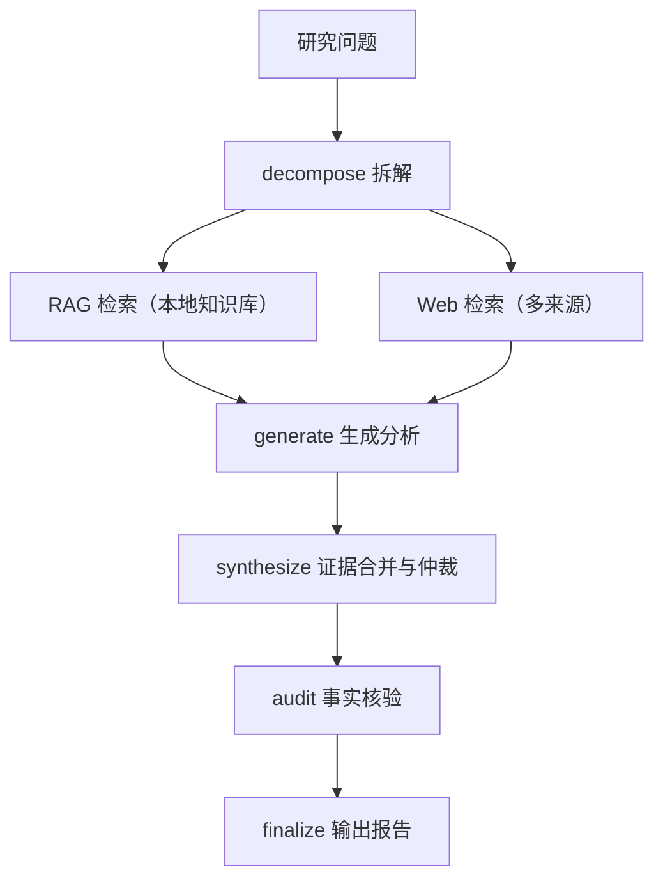

# Conflux

Conflux 是一个**本地优先的多源研究工作台**：把论文发现、知识入库、证据调研和项目进度审计串成一条可追溯的流程，最终产出带引用的 Markdown / HTML 研究报告。

适合需要持续阅读论文、运行实验、维护代码并向导师或团队汇报的研究生与个人研究者。它不替你下结论，而是让每个结论都能回到论文、文件、提交、测试或产物。

## 核心能力

- **多源检索编排** — 一次查询同时检索本地 RAG 知识库、Web 搜索和模型分析，三路证据合并后仲裁冲突。
- **可追溯的证据链** — 每个来源带声明级引用、置信度和局限说明；失败与低相关来源被标记但不会进入结论投票。
- **Chunk 级引用** — RAG 结果引用到具体文档块（`[RAG:paper-2604.13888v1#fulltext-3]`），而不是笼统的"来自某文档"。
- **事实核验闭环** — 确定性追溯检查 + 独立模型核查 + 主答案修订 + 轻量复核。
- **论文雷达（Paper Radar）** — 从 arxiv 等来源构建带评分的论文收件箱，自动决定哪些论文值得全文入库。
- **研究深度三档** — `quick` / `standard` / `deep` 三档定义检索预算、并发、核验强度与超时，对应不同规模的问题。
- **项目进度审计** — 对登记的本地项目做 Git / 测试 / 文档 / 实验产物的快照与差异审计，只读本地证据，不上传内容。
- **本地研究工作台** — 内置 Web 界面，用于管理论文、运行查询、查看审计结果。



## 快速开始

### 1. 安装

```powershell
python -m pip install -e ".[dev]"
```

复制环境变量模板并填入你的 API Key（Conflux 只通过环境变量或本地 `.env` 读取密钥，不上传项目内容）：

```powershell
Copy-Item .env.example .env
```

### 2. 配置模型

所有模型在 `config.yaml` 中配置，支持任意 OpenAI 兼容网关：

```yaml
models:
  flash:            # 快速档模型
    provider: openai_compatible
    model: deepseek-v4-flash-guan
    base_url: https://your-gateway.example/v1
  balanced:         # 中档模型
    provider: openai_compatible
    model: your-strong-model
    base_url: https://your-gateway.example/v1

embedding:
  model: text-embedding-v4   # R1 消融结论：zh-zh 满分 + zh-en 跨语言最强
  base_url: https://your-gateway.example/v1
```

也可以只设置 `OPENAI_API_KEY` 环境变量，让所有 preset 共享同一个网关密钥。

### 3. 构建本地知识库索引

```powershell
python -m conflux --index data/documents
```

Conflux 会把指定目录中的 Markdown / PDF 语料分块并写入本地 ChromaDB。索引是增量的：内容没变的块会跳过，只更新变更部分。

### 4. 跑一个研究查询

```powershell
python -m conflux "Explain how Conflux arbitrates RAG, Web, and Model evidence." --depth standard --output-dir reports --stream-events
```

`--depth` 可选 `quick` / `standard` / `deep`；`--stream-events` 以 JSON Lines 输出阶段事件，`--trace-dir` 可保留结构化 Trace。

### 5. 打开本地工作台

```powershell
python -m conflux.workbench --host 127.0.0.1 --port 8765
```

### 6. 验证报告

```powershell
python -m conflux.acceptance reports\your-report.md reports\your-report.html
```

## 命令行速查

| 命令 | 作用 |
|---|---|
| `python -m conflux "问题" --depth standard --output-dir reports` | 运行研究查询（V2 `answer_first` 管道） |
| `python -m conflux --index data/documents` | 构建/增量更新本地 RAG 索引 |
| `python -m conflux.workbench --port 8765` | 启动本地研究工作台 |
| `python -m conflux.paper_ingestion inbox --profile profiles\example_gis_agent.yaml` | 从 arxiv 构建论文收件箱 |
| `python -m conflux.paper_ingestion promote paper_inbox.json --full-text --index` | 将论文提升为知识文档并写入索引 |
| `python -m conflux.progress_audit snapshot --profile profiles\example_gis_agent.yaml` | 项目进度基线快照 |
| `python -m conflux.progress_audit audit --profile profiles\example_gis_agent.yaml` | 项目进度差异审计 |
| `python -m conflux.acceptance report.md report.html` | 校验报告产物完整性 |
| `python -m conflux plugin list` | 查看内置能力与插件 |
| `python -m conflux workflow validate tests\fixtures\architecture\workflows\research_query_v2.yaml` | 校验 YAML 工作流 |

## 评测结果

Conflux 的每个关键能力都有离线或真实 API 评测支撑，评测数据集与脚本都在仓库中。

### 真实 API 盲评（2026-08，`deepseek-v4-flash-guan`，标准深度）

三份真实报告匿名成对盲评，全部 PASS：

| 用例 | 综合得分 | 判定 | 置信度 |
|---|---|---|---|
| policy-ai-governance | 3.3 / 5 | PASS | high |
| gis-architecture-design | 3.3 / 5 | PASS | high |
| materials-method-comparison | 3.0 / 5 | PASS | high |

### R1 检索消融（NDCG@10，三语数据集各 10 题）

**底座选择（zh-zh 同语言）**：

| Embedding | 最佳 NDCG@10 |
|---|---|
| `text-embedding-v4` | **1.000** |
| `qwen3-embedding-8b` | 1.000（4096 维，开销大） |
| `jina-embeddings-v4` | 0.963 |
| `bge-m3` | 0.819–0.963 |

**跨语言（中文 query → 英文文档）**：

| Embedding | NDCG@10 |
|---|---|
| `text-embedding-v4` | **0.819** |
| `jina-embeddings-v4` | 0.815 |
| `qwen3-embedding-8b` | 0.806 |
| `bge-m3` | 0.682 |

**rerank 结论**：3 数据集 × 4 方法的 12 个组合中，**10 个下降、1 个持平、1 个微升**（+0.013）→ 默认不启用 rerank。

**落地配置**：`text-embedding-v4` + chunk 512/128 + hybrid 检索（BM25 0.3 + dense 0.7）。

### 测试基线

| 项目 | 状态 |
|---|---|
| 单元 / 集成测试 | **287 passed**（`python -m pytest -q`） |
| R1 三语评测集关键词自检 | 100% 命中 |

## 目录结构

```text
.
├── config.yaml          # 模型与检索配置
├── profiles/            # 研究画像（领域、项目路径、prompt）
├── data/
│   ├── documents/       # 本地语料：论文摘要、全文、PDF（255 md + 34 PDF）
│   └── rag_eval/        # R1 三语评测集（zh_zh / zh_en / en_en）
├── src/conflux/
│   ├── graph_v2.py      # V2 answer_first 管道（唯一管道）
│   ├── rag/             # ChromaDB 混合检索 + 索引
│   ├── paper_radar/     # 论文雷达子系统
│   ├── progress_audit/  # 项目进度审计
│   └── workbench/       # 本地 Web 工作台
├── scripts/             # 评测与工具脚本
├── examples/            # 示例报告（含冲突与失败场景）
└── tests/               # 287 个测试
```

## 文档

- [PRODUCT.md](PRODUCT.md) — 产品定位与设计原则
- [DESIGN.md](DESIGN.md) — 工作台视觉与交互约束
- [docs/README.md](docs/README.md) — 文档索引
- [docs/架构设计.md](docs/架构设计.md) — 可扩展 ResearchOps 架构蓝图
- [docs/plans/done/项目总体进展报告.md](docs/plans/done/项目总体进展报告.md) — 全部阶段状态总览
- [docs/benchmarks/V2退出报告h3.md](docs/benchmarks/V2退出报告h3.md) — V2 盲评详情
- [reports/eval/rag_ablation/R1_summary.md](reports/eval/rag_ablation/R1_summary.md) — R1 检索消融完整报告

## 安全

- API Key 只通过环境变量或本地 `.env` 提供，仓库不包含真实密钥。
- `.env`、生成的报告、Chroma 数据库、缓存与运行产物均在 `.gitignore` 中。
- 项目进度审计只读取本地证据，不执行未明确配置的命令，Git 监控严格只读。
- RAG 检索到的 Prompt Injection 文本只作为证据内容，不能成为系统指令。

## 许可证

MIT — 参见 [LICENSE](LICENSE)。
