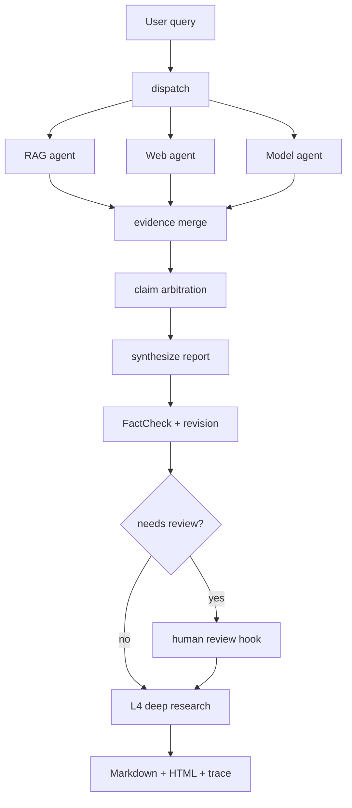

# Conflux

Conflux is an API-first multi-agent research system that combines local RAG, web search, and model knowledge into auditable Markdown and HTML reports.

The project is designed for personal use and resume demonstration: it shows source-aware agent orchestration, Evidence Graph tracing, FactCheck verification, chunk-level RAG citations, offline eval harnesses, and structured run traces.

## Technical Highlights

- LangGraph fan-out/fan-in workflow for RAG, Web, and Model agents.
- Source status protocol: every source is `success`, `failed`, or `fallback`.
- Failed/fallback sources are excluded from Evidence Graph nodes and consensus voting.
- Agent outputs include claim-level `evidence_refs`, `confidence`, and `limitations`.
- RAG results carry chunk citations such as `[RAG:quantum-crypto.txt#chunk-p0-c0]`.
- FactCheck performs deterministic leakage checks and a revision pass before human review.
- Structured trace JSONL and run summary JSON make each run inspectable.
- Offline eval scripts validate retrieval quality, report acceptance, leakage, and prompt-injection handling.

## Why LangGraph

Conflux uses LangGraph because the workflow needs explicit state boundaries, parallel branches, durable execution hooks, and resumable thread IDs. The current graph is checkpoint-ready through an in-memory checkpointer and records `run_id`, `thread_id`, checkpoint backend, source statuses, and stage progression in the report and run summary.



## Resume-Demonstrable Capabilities

- Built a reproducible API-first multi-agent research system with documented setup, sample reports, acceptance verification, and source-aware report generation.
- Implemented LangGraph-based durable orchestration with fan-out/fan-in execution, checkpoint-ready state, structured streaming traces, and human review hooks.
- Built a RAG pipeline with chunk-level citations and an offline retrieval evaluation baseline.
- Designed a claim-level collaboration protocol with confidence scoring, conflict arbitration, and failed-source exclusion.
- Developed an evaluation harness covering source failure, disagreement, hallucination leakage, prompt injection, retrieval quality, and acceptance gates.

## Repository Layout

```text
.
├── config.yaml
├── .env.example
├── examples/
├── docs/
├── data/documents/
├── prompts/
├── scripts/
│   ├── eval_retrieval.py
│   ├── eval_reports.py
│   └── eval_end_to_end.py
├── src/conflux/
│   ├── __main__.py
│   ├── graph_v2.py
│   ├── checkpointing.py
│   ├── trace.py
│   ├── source_status.py
│   ├── evidence.py
│   ├── report.py
│   ├── acceptance.py
│   ├── tools/
│   └── rag/
└── tests/
```

## Setup

```powershell
python -m pip install -e ".[dev]"
```

Copy `.env.example` to `.env` for local use only. Do not commit real keys.

The default config uses an OpenAI-compatible provider:

```yaml
models:
  reasoning:
    model: deepseek-v4-flash
    base_url: https://www.dmxapi.cn/v1

embedding:
  model: text-embedding-3-small
  base_url: https://www.dmxapi.cn/v1
```

Required for real runs:

```powershell
$env:OPENAI_API_KEY="your-api-key"
```

Optional overrides:

```powershell
$env:CONFLUX_MODELS__REASONING__API_KEY="your-api-key"
$env:CONFLUX_MODELS__CHEAP__API_KEY="your-api-key"
$env:CONFLUX_EMBEDDING__API_KEY="your-api-key"
$env:SERPAPI_API_KEY="your-serpapi-key"
```

When keys are missing, the CLI exits with a clear credential message before attempting real API calls.

## Quick Start

Build the local RAG index:

```powershell
python -m conflux --index data/documents
```

Run a Phase 2 research query:

```powershell
python -m conflux "Explain how Conflux should arbitrate RAG, Web, and Model evidence." --mode phase2 --output-dir reports --stream-events
```

Run with checkpoint-ready state:

```powershell
python -m conflux "Evaluate Loop Engineering in agent workflows." --thread-id demo-loop-001 --checkpoint-backend memory --output-dir reports
```

Resume the same thread ID:

```powershell
python -m conflux "Evaluate Loop Engineering in agent workflows." --resume demo-loop-001 --checkpoint-backend memory --output-dir reports
```

Validate a generated report:

```powershell
python -m conflux.acceptance path\to\report.md path\to\report.html
```

## Quality Gates

Run unit tests:

```powershell
python -m pytest -q
```

Run offline retrieval eval:

```powershell
python scripts/eval_retrieval.py --offline
```

Run offline report eval:

```powershell
python scripts/eval_reports.py --offline
```

Run an opt-in real API smoke test:

```powershell
python scripts/eval_end_to_end.py --real
```

## Current Offline Baselines

The deterministic offline retrieval eval writes:

- `reports/eval/retrieval_eval.md`
- `reports/eval/retrieval_eval.json`

The report eval writes:

- `reports/eval/report_eval.md`
- `reports/eval/report_eval.json`

These outputs include recall@k, hit rate, source coverage, irrelevant hit rate, acceptance pass rate, failed-source leakage, prompt-injection leakage, latency, and estimated cost.

## Examples

- [Three sources succeeded](examples/three_sources_success.md)
- [Web failed, RAG + Model succeeded](examples/web_failed_rag_model_success.md)
- [RAG and Web conflict](examples/rag_web_conflict.md)

## Security

- API keys belong in environment variables only.
- `.env`, generated reports, Chroma databases, caches, and runtime artifacts are ignored by Git.
- Prompt-injection text retrieved from RAG is treated as evidence text only, never as system instructions.
- Failed and fallback sources remain visible to the user but cannot become Evidence Graph nodes.

## License

MIT. See [LICENSE](LICENSE).
