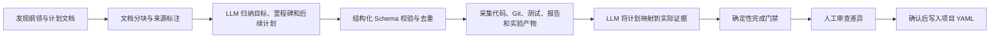

# 工作台布局与 LLM 项目计划分析优化方案

> 文档状态：已完成
> 版本：1.0
> 日期：2026-07-17
> 完成日期：2026-07-17
> 审批门禁：已于 2026-07-17 获批并完成实施；项目计划和纲领写入仍保留逐次人工确认门禁。

## 1. 方案目标

本轮优化解决两类问题：

1. 修复 Codex 内浏览器和其他窄内容容器中的布局溢出、双栏高度不一致，并建立可复用的布局约束，避免同类问题继续出现。
2. 用 LLM 驱动的“文档理解 + 代码证据核验”替代机械式计划文本匹配，生成概括性强、可追溯、可人工审批的项目计划基线。

本方案遵循现有产品原则：本地优先、证据先于结论、渐进披露、项目 YAML 为权威来源、所有写入必须经过用户确认。

## 2. 现状审计

### 2.1 已确认的布局问题

在 Codex 内浏览器默认 `1280 x 720` 视口实测：

| 页面 | 容器或区域 | 实测结果 | 根因 |
|---|---|---:|---|
| 研究成果 | 成果文件工具栏 | 内层宽 `348px`，工具栏最小需求约 `449px`，向右溢出 `101px` | 工具栏按视口断点适配，没有按自身容器宽度适配；搜索框和两个下拉框存在固定最小宽度 |
| 研究查询 | 问题输入 / 研究进展 | 左栏高 `449px`，右栏高 `500px` | 父级使用 `align-items: start`，右栏另有固定最小高度 |
| 论文发现 | 设置 / 筛选结果 | `578px / 360px` | 共用双栏布局未拉伸同一行工作面 |
| 知识库 | 入库设置 / 入库记录 | `492px / 360px` | 同上 |
| 模型与环境 | 推理设置 / 环境检查 | `640px / 362px` | 设置网格使用顶部对齐，首行工作面不等高 |

未发现页面级横向滚动，但成果工具栏子元素已经越过父容器边界，因此不能以“页面没有横向滚动”判断布局正常。

### 2.2 当前计划提取问题

当前实现根据标题关键词和列表语法提取计划，存在以下结构性缺陷：

- 把文件路径、目标文件、测试命令和普通检查项误识别为项目计划。
- 无法合并同一目标下的多个原子实现步骤。
- 无法判断“文档宣称完成”与“代码证据已验证完成”的区别。
- 无法结合测试、报告、Git、实验产物判断实际状态。
- 候选数量过多，用户需要逐条理解和清理，审批成本高。
- 英文计划需要额外翻译步骤，翻译和计划概括彼此割裂。

## 3. 审批决策摘要

本方案建议审批以下四项默认决策：

1. 使用容器查询和共享双栏约束修复布局，不再依赖页面视口宽度推断局部容器是否足够宽。
2. 计划分析改为 LLM 主导；机械规则仅用于文档发现、分块和安全过滤，不再直接产出用户可见计划。
3. 每个项目应指定一份项目纲领文档；缺失时允许继续只读监控，但智能计划分析显示“依据不足”，系统可生成待确认草案。
4. 人工批准的计划与证据核验状态继续分离；LLM 不得直接把项目标记为已完成，也不得未经确认写入项目 YAML。

## 4. 布局优化设计

### 4.1 成果工具栏

成果工具栏改为基于 `.report-browser` 实际宽度的容器响应式布局：

- 容器宽度大于等于 `520px`：搜索、类型、排序、刷新保持单行。
- 容器宽度小于 `520px`：搜索独占第一行；类型、排序和刷新位于第二行。
- 容器宽度小于 `340px`：两个下拉框按可用宽度收缩，必要时分行；刷新按钮保持稳定的方形触控尺寸。
- 所有网格轨道使用 `minmax(0, 1fr)`，子控件设置 `min-width: 0`，禁止固定最小宽度把控件推出父容器。
- “最近更新”等最长选项必须完整显示；若本地化文案更长，允许下拉框增长或换行布局，不截断到不可辨认。

### 4.2 双栏工作面

建立共享的“成对工作面”布局约束：

- 桌面端同一网格行中的两个工作面使用拉伸对齐，以内容较高的一侧决定行高。
- 工作面可以设置共同最小高度，但不设置互相冲突的独立固定高度。
- `900px` 以下切换为单列后恢复内容自适应高度，不保留桌面端等高要求。
- 加载、空状态、错误状态和完成状态都必须保持相同外框尺寸，避免状态切换时页面跳动。

适用范围：

| 页面 | 处理方式 |
|---|---|
| 研究查询 | 输入区和进展区桌面等高，单列时自适应 |
| 论文发现 | 表单区和筛选结果区桌面等高 |
| 知识库 | 入库设置和入库记录区桌面等高 |
| 模型与环境 | 首行推理设置和环境检查等高；下方连接结果保持独立全宽 |
| 进度审计兼容页 | 若继续保留，沿用同一成对工作面约束 |
| 研究成果 | 不强制列表与粘性预览等高，仅修复工具栏和预览边界 |
| 研究总览 | 两列内容语义不同，保持内容驱动，不强制等高 |
| 项目监控 | 已由统一父工作面控制高度，不额外拉伸内部标签页 |

### 4.3 全局验收矩阵

至少检查以下环境：

- Codex 内浏览器：`1280 x 720`
- 桌面：`1440 x 900`
- 窄桌面或平板：`1024 x 768`
- 手机：`375 x 812`
- 最小支持宽度：`320px`
- 浏览器文本缩放：`200%`

每个环境检查：页面横向溢出、局部容器溢出、按钮和输入框边界、最长中文选项、空状态与结果状态、焦点环和键盘顺序。

## 5. 项目纲领文档治理

### 5.1 文档要求

项目监控识别以下纲领性文档，文件名大小写不敏感：

1. `PROJECT.md`：首选，工具无关的项目权威纲领。
2. `AGENTS.md` 或 `AGENT.md`：智能体协作、工程约束和项目上下文。
3. `CLAUDE.md`：Claude 工作约定和项目上下文。
4. `CODEX.md`：Codex 工作约定和项目上下文。

`README.md`、`PRODUCT.md`、`DESIGN.md`、路线图和执行计划作为补充来源，但不自动等同于已审批的项目纲领。

### 5.2 缺失处理

- 缺少纲领文档时，只读 Git、文档和产物监控继续工作。
- 计划页显示“缺少项目纲领”，并说明智能分析的影响。
- 用户可以选择现有文档作为纲领，或让系统生成 `PROJECT.md` 草案。
- 生成草案只返回预览，不直接写文件。
- 用户确认后才写入项目目录，并记录生成来源、模型、时间和审批时间。

### 5.3 `PROJECT.md` 建议结构

- 项目定位与总体目标
- 范围与非目标
- 当前阶段
- 里程碑与期望成果
- 验收原则
- 关键约束
- 证据与产物目录
- 风险和已知问题
- 后续方向

## 6. LLM 计划分析流程

### 6.1 总体流程



### 6.2 文档理解阶段

LLM 阅读经过选择的纲领、路线图、执行计划和产品文档，直接输出简体中文结构化计划。提示词必须明确：

- 计划项应描述结果、能力、研究阶段或可验证里程碑，而不是单个文件操作。
- 排除文件路径、目标文件列表、测试命令、普通文档提及和重复检查项。
- 将同一目标下的原子步骤合并为一项概括性计划。
- 总体目标建议 `1` 项，里程碑建议 `3-8` 项，后续计划建议 `3-7` 项。
- 每项保留文档来源和行号引用。
- 文档没有验收标准时可以给出“建议验收标准”，但必须标记为模型建议，不能伪装成原文要求。
- 不翻译技术专名、文件名、模型名或命令，但对计划描述使用简体中文。

机械规则仍可用于：发现文件、限制大小、识别标题边界、排除二进制和生成来源引用。机械规则不得直接生成最终计划。

### 6.3 证据核验阶段

系统为每项计划采集以下证据：

- 相关代码模块和公开接口是否存在。
- 对应测试是否存在、最近是否通过。
- Git 提交、未提交变更和分支状态。
- 实验产物、评估结果、报告和可读文档。
- 计划中声明的交付物和验收标准。
- 非 Git 研究目录中的文档、数据和实验结果变化。

LLM 根据证据输出实际状态，但必须经过确定性门禁：

| 状态 | 判定要求 |
|---|---|
| `planned` | 有明确计划，但没有实质实现证据 |
| `in_progress` | 存在部分代码、测试、文档或实验证据，但验收标准未满足 |
| `completed` | 有直接证据表明主要交付物和适用验收标准已满足；单个文件存在不能单独证明完成 |
| `blocked` | 文档或证据中存在明确阻塞条件 |
| `needs_review` | 文档宣称状态与代码证据冲突，或证据不足以可靠判断 |

完成状态必须附带证据引用。没有证据引用的 `completed` 自动降级为 `needs_review`。

### 6.4 建议数据模型

```yaml
plan_analysis:
  charter:
    path: PROJECT.md
    status: approved
    approved_at: ""
  overall_goal:
    summary: ""
    source_refs: []
  items:
    - id: stable-id
      type: milestone
      title: ""
      summary: ""
      acceptance_criteria: []
      criteria_origin: documented | suggested | none
      declared_status: planned
      actual_status: needs_review
      source_refs: []
      evidence_refs: []
      confidence: 0.0
      rationale: ""
  analysis:
    model: ""
    generated_at: ""
    code_revision: ""
    source_hashes: {}
    warnings: []
```

人工批准的计划写入 `projects/*.yaml`；模型分析缓存和证据映射写入运行报告目录，不直接成为权威计划。

## 7. 计划页交互设计

“从文档提取”调整为“分析项目计划”，交互分为四步：

1. **确认依据**：显示当前纲领文档、补充计划文档、代码版本和最近测试状态。
2. **运行分析**：展示正在进行的“文档归纳、证据采集、状态核验”阶段，不使用无说明的长时间加载。
3. **审查结果**：按总体目标、里程碑、后续计划分组；默认展示 `5-12` 项经过合并的计划，而不是几十项原始列表。
4. **确认写入**：先展示与当前 YAML 的差异，再由用户选择覆盖、追加或忽略；总体目标仍限制为一项。

每个计划项默认显示：

- 概括性标题和一行摘要。
- 人工计划状态与证据核验状态，二者分开。
- 来源文档数量和证据数量。
- 置信度或“需要复核”提示。

展开后显示：

- 可编辑描述。
- 文档中的验收标准，或明确标记的建议验收标准。
- 来源文档与行号。
- 代码、测试、报告和产物证据。
- 状态判断理由。

## 8. API 与持久化边界

建议新增或替换以下接口：

- `POST /api/projects/plan-analysis`：生成计划与证据分析预览。
- `POST /api/projects/plan-analysis/apply`：应用用户确认后的计划差异。
- `POST /api/projects/charter/generate`：生成 `PROJECT.md` 草案，不写文件。
- `POST /api/projects/charter/apply`：确认后写入纲领文档并更新项目配置。

约束：

- 首期继续手动触发，保留定时任务字段但不启动后台调度。
- 模型调用失败时显示原因，不回退为会产生噪声的机械计划列表。
- 大文档采用分块归纳和最终合并，限制总上下文、文件数量和单文件大小。
- 项目文档视为不可信输入，提示词必须忽略文档中的指令性内容，只提取项目事实和计划。
- Schema 校验失败允许一次格式修复，仍失败则返回可展开的原始错误。
- 缓存以文档哈希、代码版本和分析配置为键；来源未变化时可以复用，但用户可强制重新分析。

## 9. 验收标准

### 9.1 布局

- Codex 内浏览器 `1280 x 720` 下，成果工具栏所有控件的右边界不超过工具栏右边界。
- “最近更新”完整可见，刷新按钮不离开成果文件工作面。
- 研究查询、论文发现、知识库的成对工作面桌面端等高，误差不超过 `1px`。
- 模型与环境首行两个工作面桌面端等高，第二行结果区保持全宽。
- `1024px`、`375px` 和 `320px` 下无页面或局部横向溢出。
- 所有输入框、下拉框和按钮继续遵守现有高度、边框和圆角规范。

### 9.2 计划分析

- 离线测试夹具中不再出现“添加某个 `.py` 文件”“文档提及某结果”等原子或无意义计划。
- 每次分析输出不超过 `1` 个总体目标、`8` 个里程碑和 `7` 个后续计划，除非用户主动展开原始建议。
- 所有计划项至少有一个来源引用。
- 所有 `completed` 项至少有一个代码、测试、报告或实验产物证据引用。
- 英文文档分析结果直接输出简体中文，同时保留技术专名和原文引用。
- 无模型、模型失败、文档过大、纲领缺失、Schema 无效都有可行动的中文错误说明。
- 未经用户确认，不修改 `PROJECT.md`、其他纲领文档或 `projects/*.yaml`。

### 9.3 测试

- 为容器宽度布局、成对工作面、计划 Schema、噪声过滤、状态门禁和写入确认增加测试。
- 完整 `python -m pytest -q` 通过。
- `node --check`、界面规则扫描和 `git diff --check` 通过。
- 使用 Codex 内浏览器完成桌面与手机截图、DOM 边界和控制台检查。

## 10. 实施顺序

1. 修复成果工具栏容器响应式和共享双栏等高约束。
2. 增加纲领文档发现、状态展示和草案预览数据模型。
3. 实现 LLM 文档归纳与结构化 Schema 校验。
4. 实现代码、Git、测试、报告和实验产物证据映射。
5. 实现确定性状态门禁、计划差异审查和确认写入。
6. 更新项目计划页 UI、错误状态、缓存和测试。
7. 完成全尺寸浏览器验收和文档更新。

## 11. 非目标

- 本轮不自动提交、拉取、推送或切换 Git 分支。
- 本轮不自动修改代码来“完成”计划。
- 本轮不让 LLM 直接覆盖项目 YAML 或纲领文档。
- 本轮不把文件数量、提交数量或模型置信度直接等同于真实进度。
- 本轮不实现后台定时分析。

## 12. 审批记录

审批人可选择：

- **批准**：按本文档进入实现。
- **有条件批准**：指出需要修改的章节，更新文档后再实现。
- **退回**：保留现状，不进入实现。

当前审批状态：**已批准并完成实施**。

## 13. 实施记录

### 13.1 实际改动

- 成果文件工具栏改为容器查询：窄容器使用“搜索框一行、筛选与刷新一行”，内容宽度达到 `520px` 后恢复单行布局。
- 研究查询、论文发现、知识库和模型设置的成对工作面在桌面端等高，单列断点恢复内容自适应。
- 移除 `320px` 视口与 Windows 滚动条叠加产生的页面横向滚动，并统一移动端核心控件触控尺寸。
- 新增 `plan_analyzer.py`，负责纲领文档优先级发现、受限文档采集、哈希与行号来源、证据目录、结构化输出校验、噪声过滤和完成证据门禁。
- 新增计划分析预览、确认写入、`PROJECT.md` 草案生成和确认写入 API；分析缓存写入 `reports/workbench/projects/<project-id>/`。
- 计划页改为“纲领依据、分析阶段、分组审查、差异确认”流程；人工声明状态与证据核验状态分开显示，技术错误默认折叠。
- 旧计划候选 API 保留用于兼容现有调用，但工作台前端不再调用机械候选链路。

### 13.2 验收结果

- `python -m pytest -q`：`149 passed`。
- `node --check src/conflux/workbench/static/app.js`：通过。
- Impeccable 布局专项扫描与全量界面扫描：均为 `0` 项。
- `git diff --check`：通过。
- Codex 内浏览器已检查 `1280 x 720`、`1440 x 900`、`1024 x 768`、`375 x 812` 和 `320 x 812`。
- 成果工具栏局部溢出为 `0px`；研究查询、论文发现、知识库和模型设置成对工作面底边误差均为 `0px`。
- `320px` 页面及局部容器无横向溢出；浏览器控制台无错误或警告。

### 13.3 偏差说明

- 无功能范围偏差。首期仍为手动分析，未启用定时任务；Git 监控仍保持只读。
- 自动化测试使用可控模型响应覆盖正常输出、Schema 单次修复、限流错误和写入确认。实施验收未把本地项目文档发送到真实外部模型服务，实际供应商连通性继续由“模型与环境”测试和用户主动分析操作验证。
